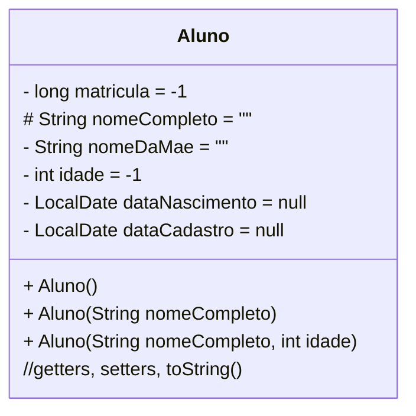

### U1 - Aula 2 - 16/05/2025 - Olá mundo, tipos primitivos (1,0)
### U1 - Aula 1 - 09/05/2025 - Git, GitHub, controle de versão, configuração do ambiente (1,0)

### Criação da conta no GitHub

1. Crie sua conta no GitHub (escolha um nome profissional - delicinhaCremosa123 é um mal exemplo). Aperte _Sign-up_ no canto superior direito em [github.com](https://www.github.com/).
2. Baixe e instale o [GitHub Desktop](https://desktop.github.com).
3. Configure o GitHub Desktop com a conta criada (_File->Options->Account_).
4. Crie um novo repositório no formato **ap3_2025.1_primeironomeSegundonome** (ex.: ap3_2025.1_fulanoSilva). Deixe privado.
5. Altere o arquivo README.md com informações sobre o repositório (dicas [aqui](https://gist.github.com/lohhans/f8da0b147550df3f96914d3797e9fb89)).
6. Faça _commit_ das alterações no repositório local.
7. Faça _push_ do repositório local para o GitHub.
8. Adicione a conta **ap3ufersa** como colaborador do repositório.
9. Siga para a configuração do ambiente.

### Configuração do ambiente

1. Instale o [JDK](https://adoptium.net/temurin/releases/) (Windows | x64 | JDK | 21 - LTS | arquivo .msi), marcando [as opções](https://drive.google.com/open?id=1BMqLvV0vZPz728qvQq2JVdf9McBGN9PY) e [liberando o firewall](https://drive.google.com/open?id=1BTl2hp2ZlEhAVqhpDfMOC0SY4ztLtMzs) caso necessário.
2. Instale o [VSCode](https://code.visualstudio.com/).
3. Instale as extensões: _Extension Pack for Java | Portuguese (Brazil) | Theme | vscode-icons | prettier java_.

### 1. Considerações sobre OO e tipos primitivos:

- **Orientação a Objetos**: é um jeito diferente de programar.
  Resumo do paradigma: modelar software como um conjunto de objetos que possuem estado (atributos) e comportamento (métodos).
  Outros paradigmas: imperativo, procedural, funcional, lógico, declarativo, reativo.

- **Tipos Primitivos**: tipos de dados básicos fornecidos pela linguagem Java para armazenar valores simples. São armazenados diretamente na memória (_stack_) e têm um tamanho fixo. Não são objetos, portanto, não possuem métodos associados. Ascomparações são feitas com operadores ==,<, >. Os limites [são esses](tiposPrimitivos.png).

- **Classes (String, Integer)**: Em Java, classes são "moldes" para objetos. Um objeto é uma instância de uma classe. As variáveis que são instâncias de classes são referências aos objetos armazenados na memória (_heap_). Classes podem ter métodos e atributos associados. Usa-se o método .equals(). Usar == compara referências de memória.

- **String** é uma classe _muito_ especial usada para representar [sequências de caracteres](stringEmJava.png)

- **GUI**: Posso usar IA para gerar interface gráfica [GUI - Graphical User Interface](exemplos_gui).

- **Diagrama de Classes**: pode ser usado para começar a modelagem e virar software.

### Exercícios em Sala

Salve na pasta unidade1\exercicio1\

Gabaritos para ajudar no exercícios [aqui](gabaritos).

Após concluir cada questão, faça _commit_ localmente e sincronize-o (_push_) com o seu repositório remoto no GitHub. Conforme [figura](https://drive.google.com/open?id=1dV5TwUdMxSmh80sx13epVcJFewIT_MVk).