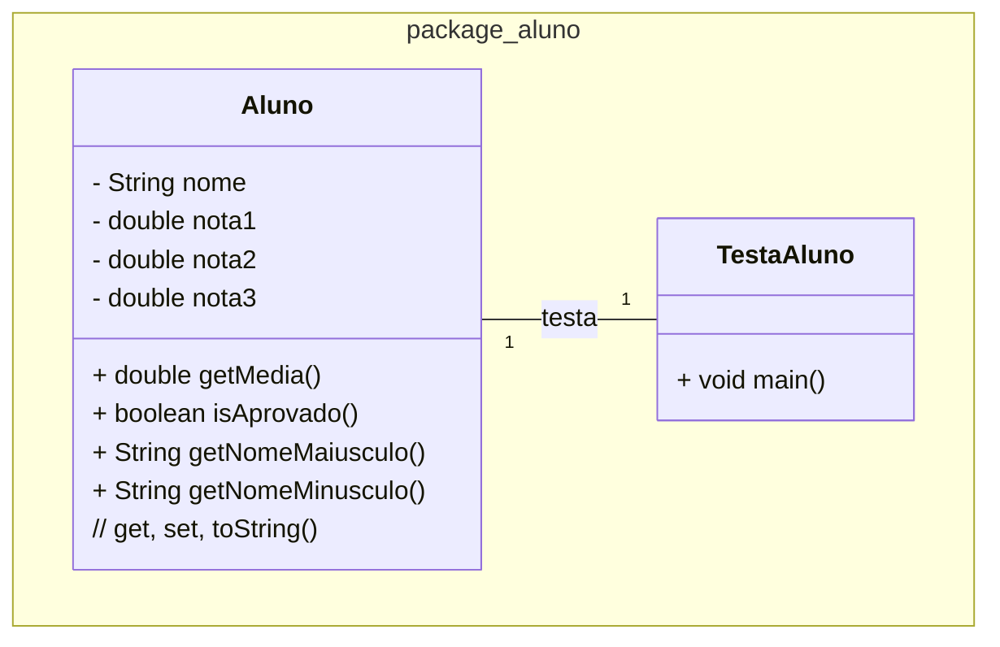
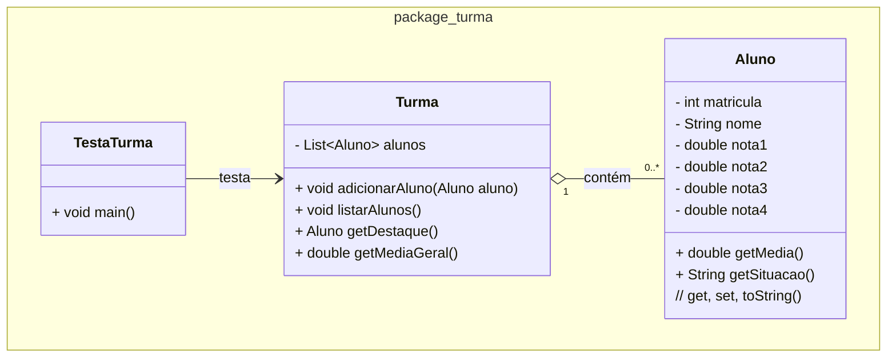

### U1 - Aula 3 - 27/03/2026 (1,0) - Classe, objeto, método, atributo

### 0. Gabaritos

Gabaritos para ajudar nos exercícios [aqui](gabaritos).

### 1. Considerações sobre OO e tipos primitivos

- **Tipos Primitivos**: tipos de dados básicos fornecidos pela linguagem Java para armazenar valores simples. São armazenados diretamente na memória (_stack_) e têm tamanho fixo. Não são objetos, portanto não possuem métodos associados. Comparações são feitas com operadores `==`, `<`, `>`. Os limites [são esses](tiposPrimitivos.png).

- **Classes (String, Integer)**: em Java, classes são "moldes" para objetos. Um objeto é uma instância de uma classe. Variáveis que são instâncias de classes são referências a objetos armazenados na memória (_heap_). Classes podem ter métodos e atributos. Usa-se `.equals()` para comparar conteúdo; `==` compara referências de memória.

### 2. Exercícios Resolvidos

Salve na pasta `/unidade1/aula3/?.java`

1. Programação Estruturada - Cálculo de Média: Crie um programa Java que calcule a média de três notas usando programação estruturada. Não use classes ou objetos além do `main`.

2. Programação O.O. — Aluno com Cálculo de Média: Crie uma classe `Aluno` com atributos nome e três notas. Implemente métodos para calcular a média, verificar aprovação (média >= 7.0) e exibir o nome em maiúsculas e minúsculas. Crie `TestaAluno` para instanciar três alunos e exibir suas informações. Gere getters, setters e `toString`.

3. Turma com Ranking: Implemente um sistema de gerenciamento de turma com as seguintes regras de negócio:

- Um `Aluno` possui: matrícula (int), nome (String), e quatro notas (double).
- A média é calculada descartando a **menor nota** entre as quatro (média das três maiores).
- Situação: aprovado se média >= 7.0; recuperação se média >= 5.0 e < 7.0; reprovado se média < 5.0.
- Uma `Turma` possui uma lista de alunos e os seguintes comportamentos:
  - adicionar aluno
  - listar todos os alunos com nome, média e situação
  - retornar o aluno com a maior média (destaque da turma)
  - retornar a média geral da turma
- `MainTurma` instancia uma turma, adiciona pelo menos quatro alunos com notas variadas e exibe o relatório completo.

- `getMedia()` em `Aluno` deve usar `Math.min()` para descartar a menor nota.
- `getDestaque()` em `Turma` deve percorrer a lista sem usar streams.
- Nenhum cálculo em `MainTurma`; toda lógica fica em `Aluno` e `Turma`.
- Gere getters, setters e `toString` em `Aluno`.

### Exercícios em Sala

Gabaritos para ajudar no exercícios [aqui](gabaritos).

Após concluir cada questão, faça _commit_ localmente e sincronize-o (_push_) com o seu repositório remoto no GitHub. Conforme [figura](https://drive.google.com/open?id=1dV5TwUdMxSmh80sx13epVcJFewIT_MVk).

Entregue a folha assinada!