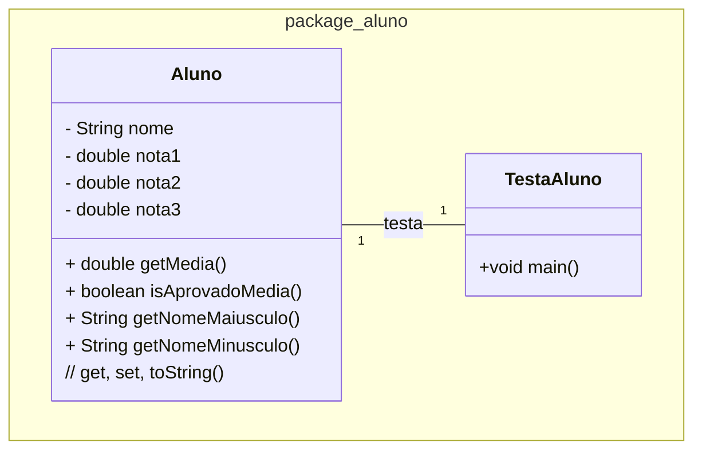

### U1 - Aula 4 - 10/04/2026 (2,0) - Classe, objeto, método, atributo

### 0. Gabaritos

Gabaritos para ajudar no exercícios [aqui](gabaritos).

### 1. Exercícios Resolvidos

0. Salve na pasta /unidade1/aula4/?.java

1. Programação O.O. - Aluno com Cálculo de Média: Crie uma classe ```Aluno``` que tenha os atributos nome e três notas. Implemente métodos para calcular a média das notas e para verificar se o aluno foi aprovado (média maior ou igual a 7.0) ou reprovado. Implemente métodos para exibir o nome do aluno em letras maiúsculas e minúsculas. Crie uma classe TestaAluno para instanciar três alunos e exibir suas informações, incluindo a média e o status de aprovação. Implemente/gere automagicamente getters, setters e toString.



### Exercícios em Sala

Após concluir cada questão, faça _commit_ localmente e sincronize-o (_push_) com o seu repositório remoto no GitHub. Conforme [figura](https://drive.google.com/open?id=1dV5TwUdMxSmh80sx13epVcJFewIT_MVk).

Entregue a folha assinada!