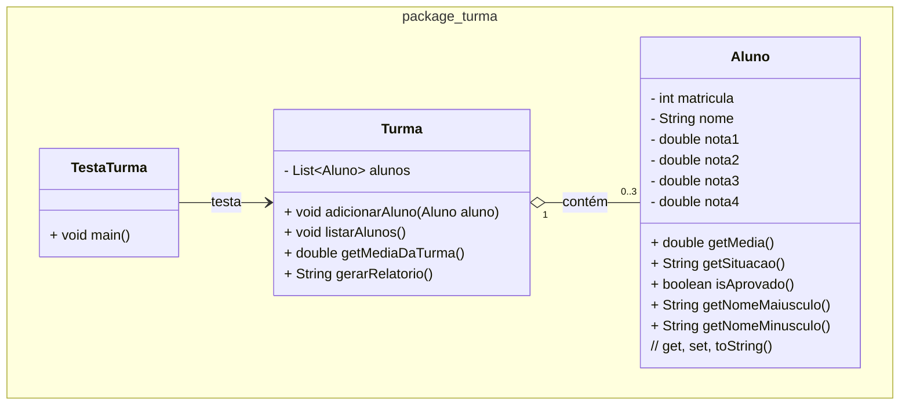

### U1 - Aula 5 - 17/04/2026 (1,0) - Scanner, datas

### 0. Início

[Ranking do OpenRouter - IA](openrouter_ranking_IA.jpg).

[Cadastro de aluno com GUI](cadastro-aluno-javafx)

### 1. Conceitos

- **Debugging em tempos de IA**: encontrar e corrigir defeitos no código. IA erra com confiança. Fazer no vscode...

- **Scanner**: classe de `java.util` que lê entrada do usuário pelo terminal.

| Método | Lê |
|---|---|
| `nextLine()` | linha inteira (String) |
| `nextInt()` | inteiro |
| `nextDouble()` | decimal |

- **Problemas**: `nextDouble()` lê o número mas **não consome a quebra de linha** (`\n`). O `nextLine()` seguinte lê e desconsidera quebra.

```java
double nota = scanner.nextDouble();
scanner.nextLine(); // descarta o '\n' residual
String nome = scanner.nextLine(); // lê corretamente
```

- **Vírgula vs ponto**: em sistemas com locale `pt_BR`, `nextDouble()` aceita vírgula (`7,5`). Em outros, só aceita ponto (`7.5`).

- **Parsing**: fazer parsing é interpretar uma `String` e extrair dela um valor com significado. Em computação, `"17/04/2026"` é só texto — para virar uma data utilizável precisa ser parseado. Em Programação Web tem parsing de JSON, onde o backend recebe JSON do frontend e transforma em objetos Java. Veja exemplo no [Mockaroo](https://mockaroo.com).

  - **Manual com `split()`**.
  - **`DateTimeFormatter`**.

```java
String entrada = "17/04/2026";

// Parsing com split("/")
String[] partes = entrada.split("/"); // ["17", "04", "2026"]
int dia  = Integer.parseInt(partes[0]); // 17
int mes  = Integer.parseInt(partes[1]); // 4
int ano  = Integer.parseInt(partes[2]); // 2026
LocalDate dataManual = LocalDate.of(ano, mes, dia);

// Parsing com DateTimeFormatter
DateTimeFormatter fmt = DateTimeFormatter.ofPattern("dd/MM/yyyy");
LocalDate dataFmt = LocalDate.parse(entrada, fmt);

System.out.println(dataManual); // 2026-04-17
System.out.println(dataFmt);    // 2026-04-17
```

### 2. Exercício Resolvido

Salve na pasta `/unidade1/aula5/?.java`

#### Modificação da Turma com Scanner

Partindo das classes `Aluno` e `Turma` da aula 4, modifique `TestaTurma` para que os dados dos alunos sejam lidos do usuário via `Scanner`. Leia matrícula, nome e as quatro notas de três alunos. Ao final, exiba o relatório da turma com nome em maiúsculo, média do aluno, situação de cada aluno e a média geral da turma. 

#### Desafio?
- Sanitizar a entrada do nome? (trim, vazio, tamanho minimo)

- Buscar por nome?



### Exercícios em Sala

Gabaritos para ajudar no exercícios [aqui](gabaritos).

Após concluir cada questão, faça _commit_ localmente e sincronize-o (_push_) com o seu repositório remoto no GitHub. Conforme [figura](https://drive.google.com/open?id=1dV5TwUdMxSmh80sx13epVcJFewIT_MVk).

Entregue a folha assinada!