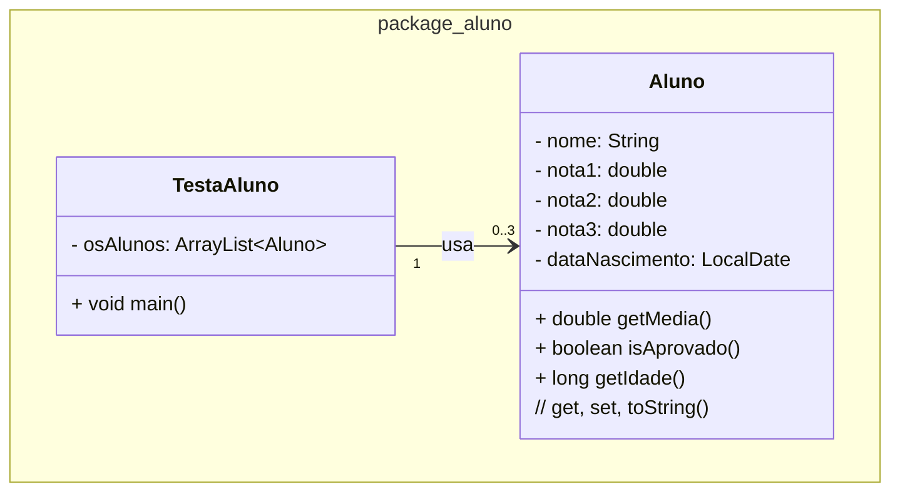

### U1 - Aula 5 - 17/04/2026 (1,0) - Scanner, datas

### 0. Gabaritos

Gabaritos para ajudar nos exercícios [aqui](gabaritos).

### 1. Conceitos desta aula

- **Scanner**: classe de `java.util` que lê entrada do usuário pelo terminal. Instanciada com `new Scanner(System.in)`. Feche sempre com `.close()` ao final.

| Método | Lê |
|---|---|
| `nextLine()` | linha inteira (String) |
| `nextInt()` | inteiro |
| `nextDouble()` | decimal |

- **LocalDate / LocalDateTime**: classes de `java.time` para representar datas e data+hora sem fuso horário. Imutáveis. Criadas com `LocalDate.now()`, `LocalDate.of(ano, mes, dia)` ou `LocalDate.parse("2026-04-17")`.

```java
LocalDate hoje = LocalDate.now();
LocalDate nascimento = LocalDate.of(2000, 3, 15);
long idade = ChronoUnit.YEARS.between(nascimento, hoje);
```

- **`DateTimeFormatter`**: formata e analisa datas. Exemplo: `DateTimeFormatter.ofPattern("dd/MM/yyyy")`.

### 2. Exercício Resolvido

Salve na pasta `/unidade1/aula5/?.java`

#### Lista de Alunos com Scanner

Crie uma classe `Aluno` com atributos `nome`, três notas e `dataNascimento` (`LocalDate`). Implemente `getMedia()`, `isAprovado()` e `getIdade()` (anos completos até hoje). O `toString()` deve exibir nome, média, situação e idade. Crie `TestaAluno` para ler 3 alunos via `Scanner`, guardá-los num `ArrayList` e exibir todos ao final.



- Toda lógica de cálculo fica em `Aluno`; `TestaAluno` só lê, armazena e exibe.
- Use `scanner.nextLine()` após `nextDouble()` para consumir a quebra de linha antes de ler a data.
- Leia a data no formato `dd/MM/yyyy` com `DateTimeFormatter`.

### Exercícios em Sala

Exercício [aqui](exercicio_aula5.md).

Após concluir, faça _commit_ localmente e sincronize-o (_push_) com o seu repositório remoto no GitHub. Conforme [figura](https://drive.google.com/open?id=1dV5TwUdMxSmh80sx13epVcJFewIT_MVk).

Entregue a folha assinada!
