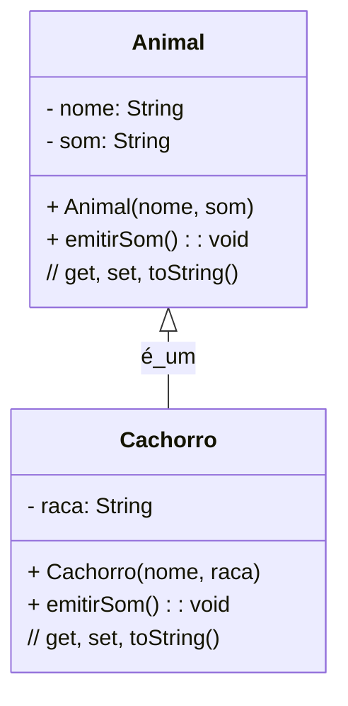
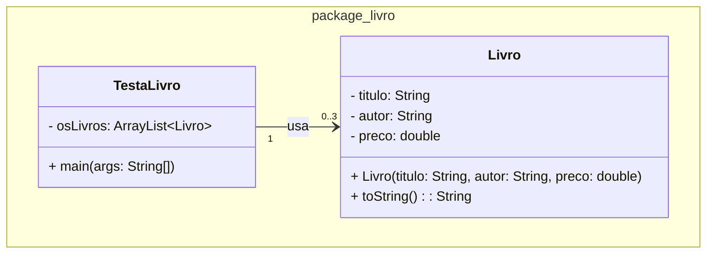
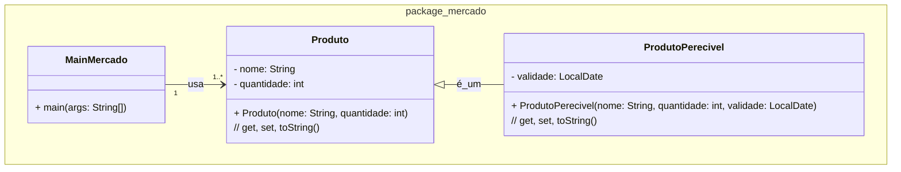

### U1 - Aula 5 - ??/04/2026 (1,0) - Scanner, ArrayList e introdução à herança

### 0. Gabaritos

[Ranking do OpenRouter - IA](openrouter_ranking_IA.jpg).

Gabaritos para ajudar nos exercícios [aqui](gabaritos).

### 1. Conceitos

- **Scanner**: classe de `java.util` que lê entrada do usuário pelo terminal. Cada chamada a `nextLine()`, `nextInt()`, `nextDouble()` lê um token da entrada padrão (`System.in`).

- **ArrayList**: implementação de lista dinâmica de `java.util`. Diferente de arrays, cresce automaticamente. Acesso por índice com `.get(i)`, adição com `.add(obj)`, tamanho com `.size()`.

- **Herança**: mecanismo pelo qual uma subclasse (`extends`) herda atributos e métodos de uma superclasse. A subclasse pode sobrescrever (`@Override`) comportamentos. Relação semântica: "é um".

- **`super()`**: chama o construtor da superclasse. Deve ser a primeira instrução do construtor da subclasse.



### 2. Exercícios Resolvidos

Salve na pasta `/unidade1/aula5/?.java`

#### Exercício 1 — Livros com Scanner e ArrayList

Crie um programa em Java para ler do usuário as informações de 3 livros. A classe `Livro` deve ter os atributos `titulo`, `autor` e `preco`. O `toString()` deve exibir no formato `"titulo;autor;R$ XX,00"` (CSV). O método `main` da classe `TestaLivro` deve ler as informações via `Scanner`, guardar os livros em um `ArrayList` e exibir todos ao final.



- Nenhum cálculo ou lógica de negócio em `TestaLivro`; apenas leitura, armazenamento e exibição.
- Use `new Scanner(System.in)` e feche-o com `.close()` ao final.
- Use `String.format("R$ %.2f", preco)` no `toString()`.

#### Exercício 2 — Produtos com herança

Crie um programa em Java para gerenciar produtos de um mercado aplicando herança. A classe `Produto` tem `nome` e `quantidade`. A subclasse `ProdutoPerecivel` herda de `Produto` e adiciona `validade` (`LocalDate`). Em `MainMercado`, crie 3 produtos normais e 2 perecíveis, guarde todos numa `ArrayList<Produto>` e exiba cada um.



- `ProdutoPerecivel.toString()` deve chamar `super.toString()` e acrescentar a validade.
- Não deve ser possível instanciar um produto com `quantidade < 0`; lance `IllegalArgumentException` no setter.
- Toda a lista deve ser do tipo `ArrayList<Produto>` para demonstrar polimorfismo de referência.

Pedaço do `main`:

```java
ArrayList<Produto> estoque = new ArrayList<>();
estoque.add(new Produto("Copo", 10));
estoque.add(new ProdutoPerecivel("Queijo", 5, LocalDate.of(2026, 5, 1)));
// ...
for (Produto p : estoque) {
    System.out.println(p);
}
```

### Exercícios em Sala

Após concluir cada questão, faça _commit_ localmente e sincronize-o (_push_) com o seu repositório remoto no GitHub. Conforme [figura](https://drive.google.com/open?id=1dV5TwUdMxSmh80sx13epVcJFewIT_MVk).

Entregue a folha assinada!
