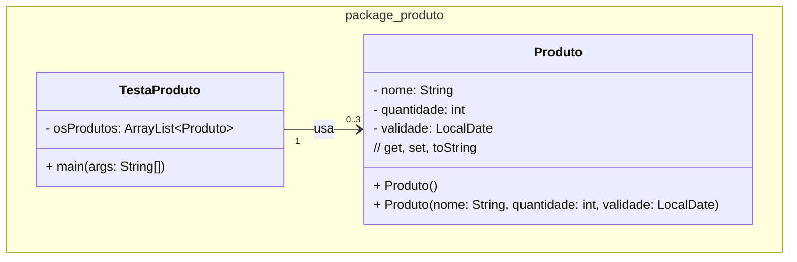

### U1 - Aula 5 - 17/04/2026 - Scanner, datas (1,0)

#### 1. (1,0) Produtos com Scanner

Crie um programa em Java para ler do usuário as informações de 3 produtos. A classe `Produto` deve ter os atributos `nome`, `quantidade` (`int`) e `validade` (`LocalDate`). O `toString()` deve exibir no formato `"nome;quantidade;validade"`, com a data no padrão `dd/MM/yyyy`. O método `main` da classe `TestaProduto` deve ler as informações via `Scanner`, guardar os produtos num `ArrayList` e exibir todos ao final.

- Leia a data no formato `dd/MM/yyyy` com `DateTimeFormatter`.
- Não deve ser possível instanciar um produto com `quantidade < 0`.
- Toda lógica fica em `Produto`; `TestaProduto` só lê, armazena e exibe.
