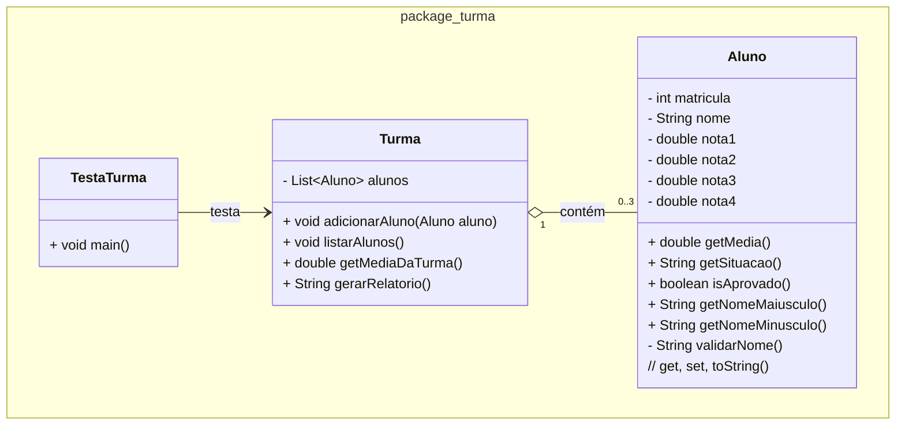

### U2 - Aula 7 - 08/05/2026 (2,0) - Visibilidade, composição

### 1. Conceitos

- **Debugging em tempos de IA**: encontrar e corrigir defeitos no código. IA erra com confiança. Fazer no vscode...

- **Scanner**: classe de `java.util` que lê entrada do usuário pelo terminal.

- Private, public, protected (+, -, #)

### 2. Exercício Resolvido

Salve na pasta `/unidade2/aula7/?.java`

#### Modificação da Turma com Validação do Nome

Partindo das classes `Aluno` e `Turma` da aula 4, modifique `TestaTurma` para que os dados dos alunos sejam lidos do usuário via `Scanner`. Leia matrícula, nome e as quatro notas de três alunos. Ao final, exiba o relatório da turma com nome em maiúsculo, média do aluno, situação de cada aluno e a média geral da turma. 

#### Desafio?
- Sanitizar a entrada do nome? (trim, vazio, tamanho minimo)

- Buscar por nome?

### Exercícios em Sala

Gabaritos para ajudar no exercícios [aqui](gabaritos).

Após concluir cada questão, faça _commit_ localmente e sincronize-o (_push_) com o seu repositório remoto no GitHub. Conforme [figura](https://drive.google.com/open?id=1dV5TwUdMxSmh80sx13epVcJFewIT_MVk).

Entregue a folha assinada!