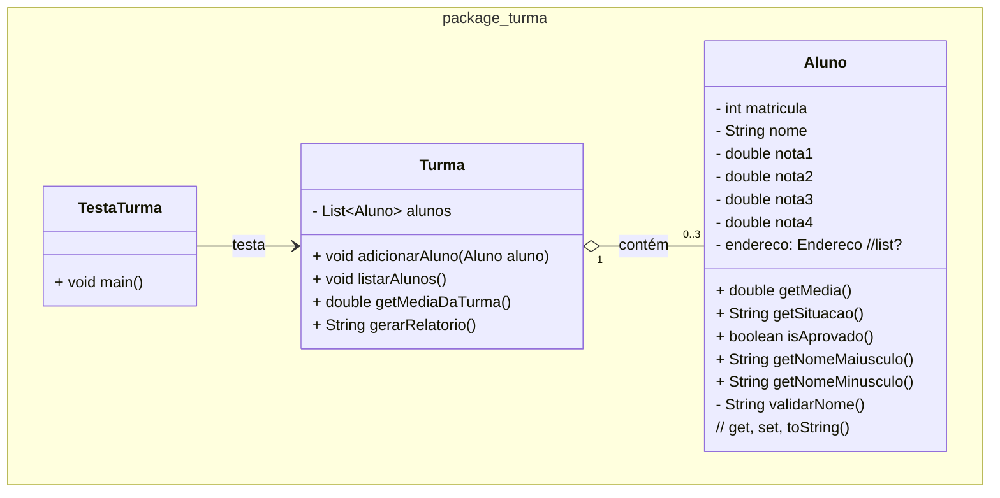
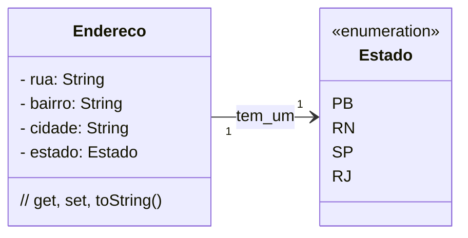

### U2 - Aula 8 - 15/05/2026 (3,0) - Java Collections, herança e polimorfismo

### 1. Conceitos

### Pra que composição?

0. Editor hexadecimal?

1. Private, public, protected (+, -, #)

2. Composição = relação "tem um" entre objetos, onde um objeto contém ou é formado por outros objetos. Dependência forte, indicando que a existência dos objetos componentes depende do objeto composto (se um desaparece, o outro também desaparece).

3. Em interfaces gráficas, um componente visual contém outros componentes menores (um painel inclui botões, campos de texto e rótulos, de forma hierárquica). Na prática fica [assim](gui_composicao.jpg).

4. Java collections [aqui](https://en.wikipedia.org/wiki/Java_collections_framework#/media/File:Java_collections_framework_class_hierarchy.svg).

#### Modificação de Aluno com Lista de Endereços

1. Crie uma classe `Aluno` que tenha os atributos nome e três notas. Crie a classe Endereço, com Rua, Bairro, Cidade e Estado. Cada aluno tem apenas 1 endereço (ou não...). Componha as classes e teste na classe `TestaAluno`.

### Endereço:

### Exercícios em Sala

Gabaritos para ajudar no exercícios [aqui](gabaritos).

Após concluir cada questão, faça _commit_ localmente e sincronize-o (_push_) com o seu repositório remoto no GitHub. Conforme [figura](https://drive.google.com/open?id=1dV5TwUdMxSmh80sx13epVcJFewIT_MVk).

Entregue a folha assinada!
