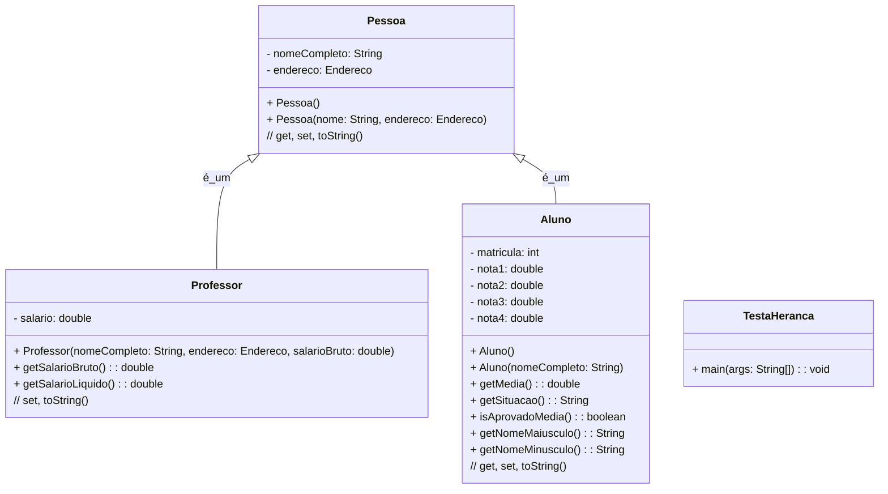
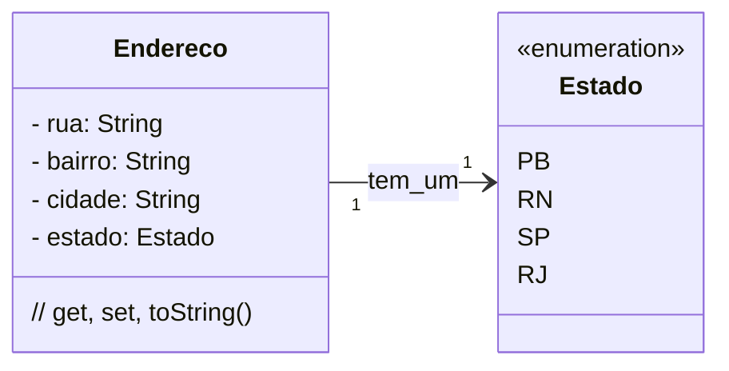

### U3 - Aula 10 - 29/05/2026 (2,0) - Herança

### 1. Conceitos

- **Herança** (`extends`): mecanismo pelo qual uma subclasse absorve atributos e métodos de uma superclasse. `Aluno extends Pessoa` significa que `Aluno` **é uma** `Pessoa` — tem `nomeCompleto` e `endereco` sem redeclará-los. A superclasse não conhece as subclasses.

  O construtor da subclasse **deve** chamar `super(...)` como primeira instrução para inicializar a parte herdada — caso contrário o compilador rejeita.

  ```java
  public Aluno(String nome, Endereco endereco, String matricula) {
      super(nome, endereco); // inicializa Pessoa
      this.matricula = matricula;
  }
  ```

  Herança deve modelar uma relação semântica real de identidade. O teste: "um `Aluno` **é uma** `Pessoa`?" — sim. "Um `Estoque` **é um** `Produto`?" — não; nesse caso usa-se composição.

- **`@Override`**: anotação que indica que o método sobrescreve um da superclasse, e o compilador valida.

- **Composição** (`o--`): `Pessoa` **tem um** `Endereco`. Modela posse, não identidade.

- Herança é muito usada em frameworks (swing, spring), no android, em exceptions. Prefira composição.

### Diagrama de classes:



### Endereço:



### Main:

```java
public class TestaHeranca {
    public static void main(String[] args) {
        Endereco enderecoAluno = new Endereco();
        enderecoAluno.setRua("Rua do Aluno");
        enderecoAluno.setCidade("Angicos");
        enderecoAluno.setEstado(Estado.RN);

        Endereco enderecoProf = new Endereco();
        enderecoProf.setRua("Rua do Professor");
        enderecoProf.setCidade("Angicos");
        enderecoProf.setEstado(Estado.RN);

        Aluno umAluno = new Aluno("Joãozinho da Silva");
        umAluno.setMatricula(20231057);
        umAluno.setMeuEndereco(enderecoAluno);

        Professor umProfessor = new Professor("Josefa de Arruda", enderecoProf, 1500.00);

        System.out.println(umAluno);
        System.out.println(umProfessor);
    }
}
```

### Exercícios em Sala

Gabaritos para ajudar no exercícios [aqui](gabaritos).

Após concluir cada questão, faça _commit_ localmente e sincronize-o (_push_) com o seu repositório remoto no GitHub. Conforme [figura](https://drive.google.com/open?id=1dV5TwUdMxSmh80sx13epVcJFewIT_MVk).

Entregue a folha assinada!
