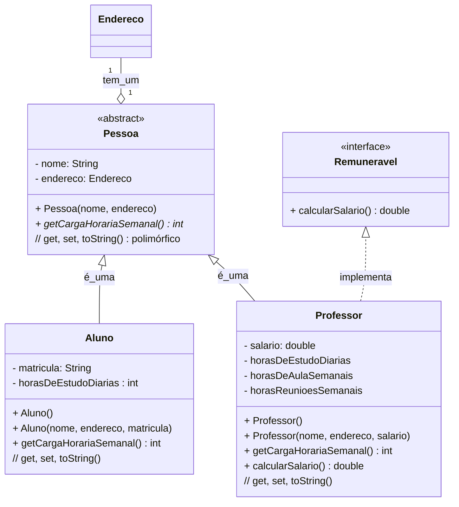
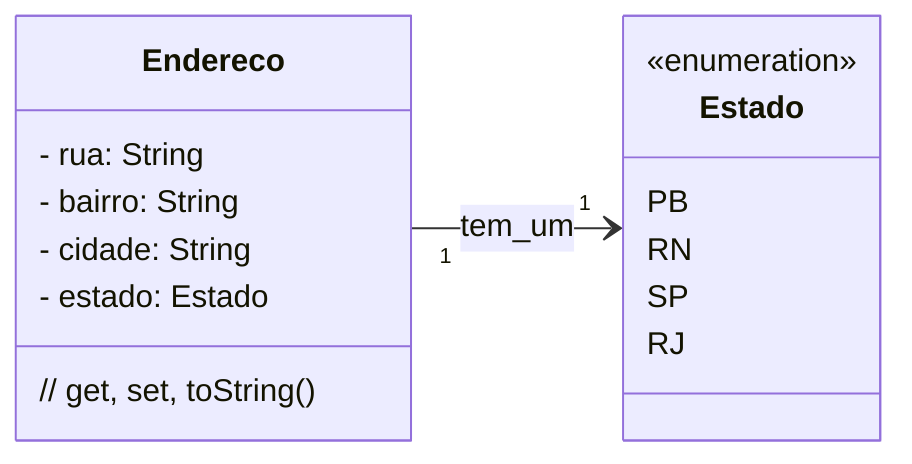

### U2 - Aula 9 - 08/05/2026 (2,0) - Visibilidade, composição

### 1. Conceitos

- **Debugging em tempos de IA**: encontrar e corrigir defeitos no código. IA erra com confiança. Fazer no vscode...

- **Scanner**: classe de `java.util` que lê entrada do usuário pelo terminal.

- Private, public, protected (+, -, #)

### Pessoa com Polimorfismo e Abstract:



### Endereço:



### Main:

```java
package package_polimorfismo;

public class MainPolimorfismo {
    public static void main(String[] args) {
        Endereco enderecoAluno = new Endereco("Rua do Aluno", "Centro", "Angicos");
        Endereco enderecoProf = new Endereco("Rua do Professor", "Centro", "Angicos");

        Aluno umAluno = new Aluno("Joãozinho da Silva", enderecoAluno, "20231057");
        umAluno.setHorasDeEstudoDiarias(2);

        Professor umProfessor = new Professor("Josefa de Arruda", enderecoProf, 1500.00);
        umProfessor.setHorasDeAulaSemanais(8);
        umProfessor.setHorasDeEstudoDiarias(2);
        umProfessor.setHorasReunioesSemanais(2);

        Pessoa polimorfica = new Professor("Um professor polimórfico", enderecoProf, 15000.00);

        System.out.println();
        System.out.println(umAluno);
        System.out.println(umProfessor);
        System.out.println(polimorfica);
    }
}
```

### Exercícios em Sala

Gabaritos para ajudar no exercícios [aqui](gabaritos).

Após concluir cada questão, faça _commit_ localmente e sincronize-o (_push_) com o seu repositório remoto no GitHub. Conforme [figura](https://drive.google.com/open?id=1dV5TwUdMxSmh80sx13epVcJFewIT_MVk).

Entregue a folha assinada!
