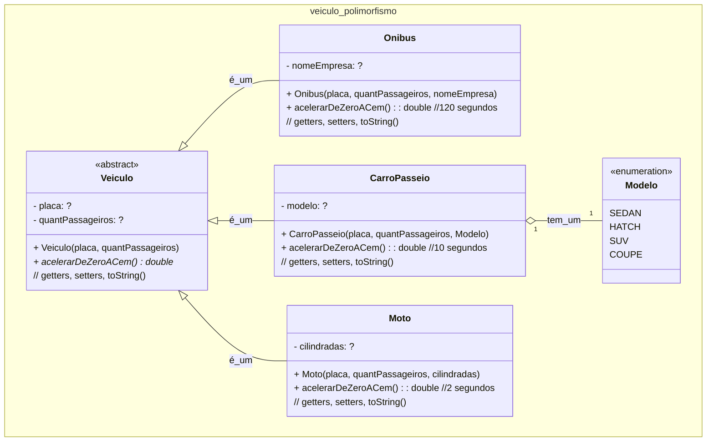

### U3 - Aula 11 - 12/06/2026 (2,0) - Herança, composição, polimorfismo

#### 1. Agregação, composição, herança

- Modelagem de portas em [UML](aula11/1_portas.md)

#### 2. Herança, composição, polimorfismo

- Pessoa, aluno e professor em [UML e Java](aula11/2_pessoa.md)

#### 3. Modelagem de veículos

- Veículo, moto, ônibus e carro em [Java](aula11/3_veiculos.md)


### Unidade 2 - Exercício 2 - Com nota em 13/09/2024 até as 22:20:00h

#### 0. (2,0) Veículos Polimórficos e Abstratos

Crie um programa em Java para gerenciar uma empresa de veículos. Crie a classe Veículo, abstrata, com a placa e quantidade de pessoas. Há um método abstrato para acelerarDeZeroACem. Um ônibus é um veículo e possui o nome da empresa que opera a linha e vai de zero a cem km/h bem devagar. Um carro de passeio vai de zero a cem em 10 segundos. Uma moto é um veículo que tem uma quantidade de cilindradas e vai de zero a cem em 2 segundos. Faça uma classe separada, com método ```main```, para testar o programa, usando todas as classes, de forma polimórfica e de forma não polimórfica. Exiba os veículos criados e acelere todos de zero a cem.



### Main:
	
```java
public class MainVeiculo {

    //Faça 2 veículos de cada classe
    public static void main(String[] args) {
        comPolimorfismo();
        semPolimorfismo();
    }

    public static void comPolimorfismo() {
        //Veiculo umVeiculo = new Veiculo(...);
        Veiculo umCarro = new CarroPasseio(...);
        Veiculo umOnibus = new Onibus(...);
        Veiculo umaMoto = new Moto(...);

        //Exiba antes de acelerar

        umCarro.acelerarDeZeroACem();
        umOnibus.acelerarDeZeroACem();
        umaMoto.acelerarDeZeroACem();
        
    }

    public static void semPolimorfismo() {
        //Veiculo umVeiculo = new Veiculo(...);
        CarroPasseio umCarro = new CarroPasseio(...);
        Onibus umOnibus = new Onibus(...);
        Moto umaMoto = new Moto(...);

        //Exiba antes de acelerar

        umCarro.acelerarDeZeroACem();
        umOnibus.acelerarDeZeroACem();
        umaMoto.acelerarDeZeroACem();
    }
}
```
