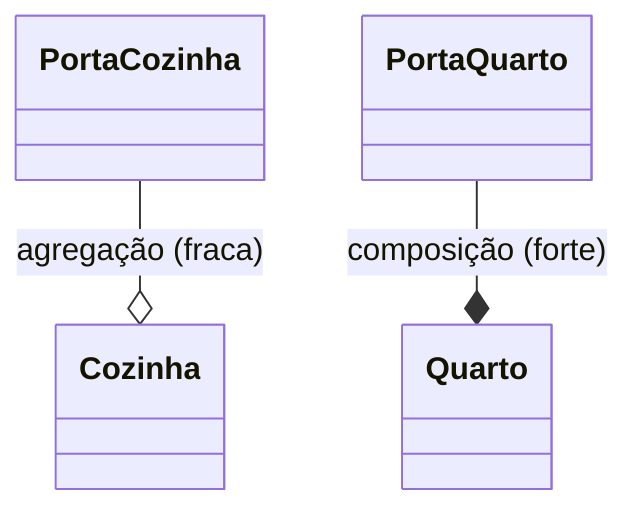
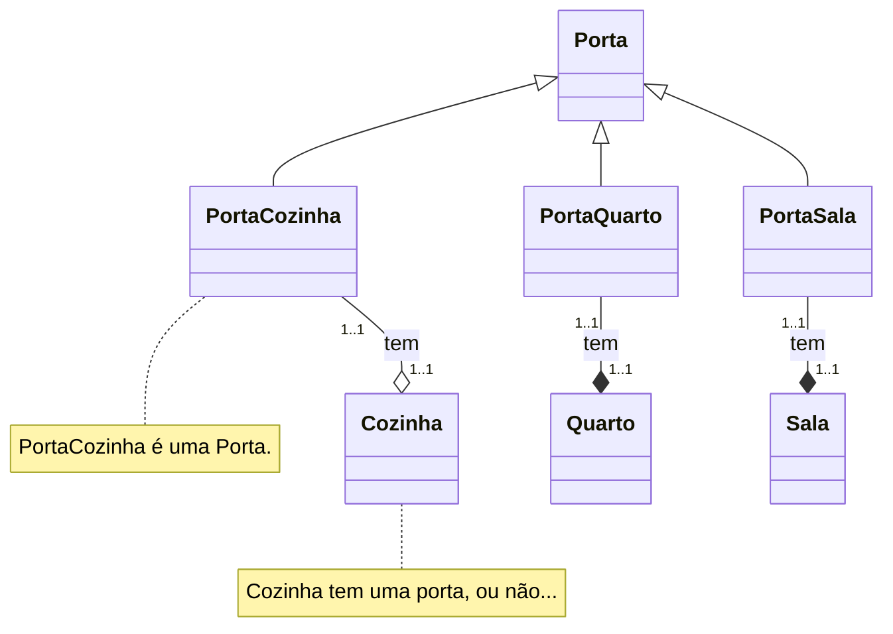
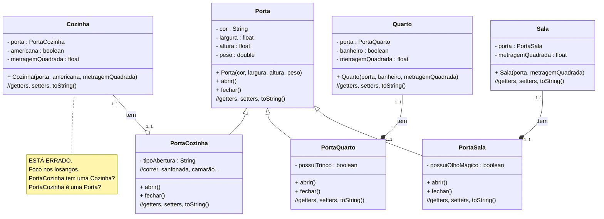
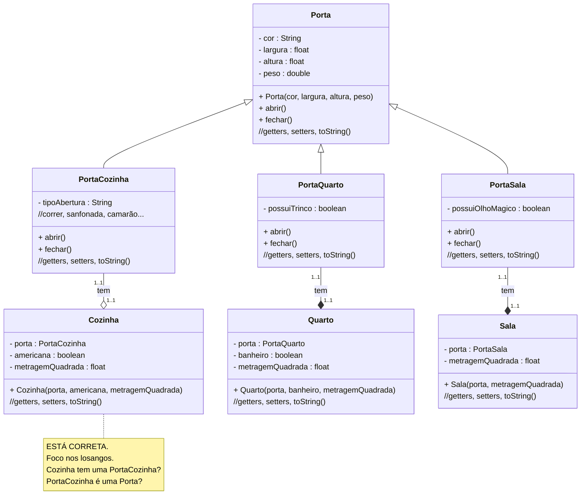

# U3 - Aula 11 - 12/06/2025 - Herança, composição, polimorfismo (2,0)

### Leitura dos Relacionamentos

---



```text
O losango fica do lado de quem tem.
```

---



---

## Modelagem Errada



---

## Modelagem Correta



```text
O losango fica do lado de quem tem.
```
