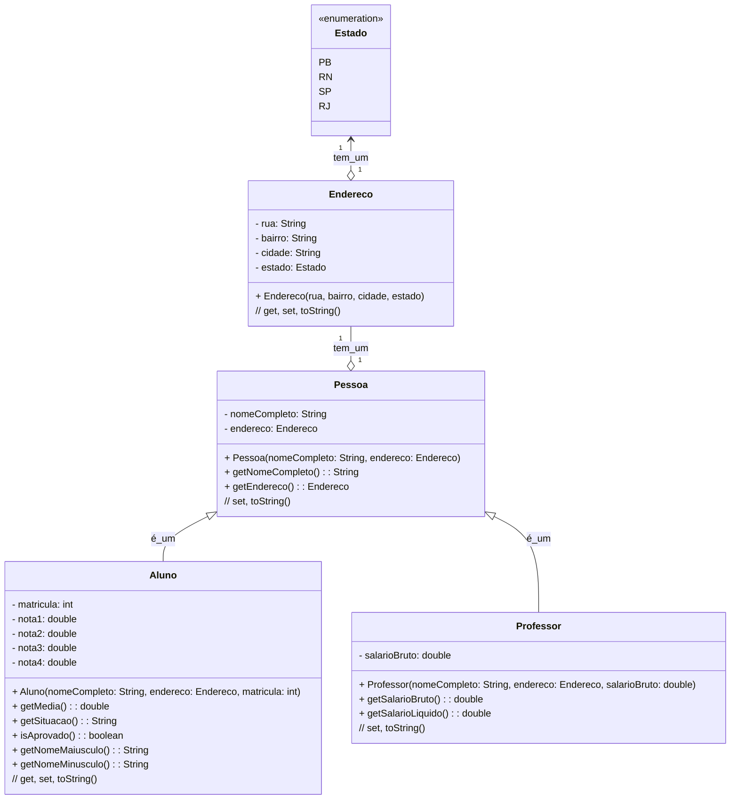
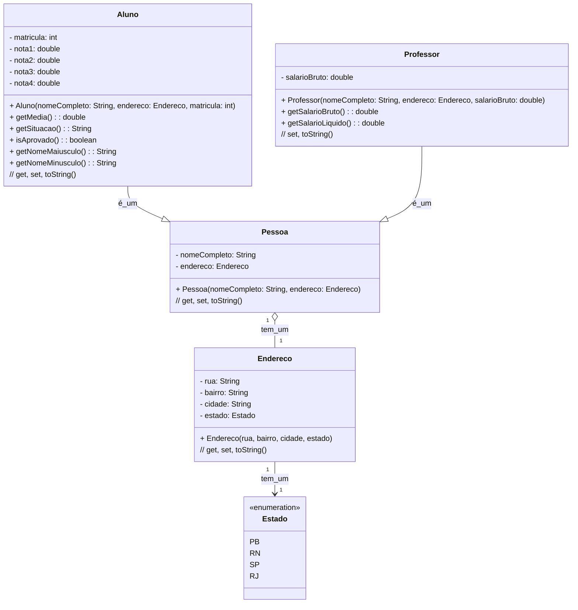

# U3 - Aula 11 - 12/06/2025 - Herança, composição, polimorfismo (2,0)

## Diagrama de classes



## O que é igual (herdado)

`Aluno` e `Professor` herdam `nomeCompleto` e `endereco` de `Pessoa`.

O construtor de cada subclasse chama `super(nomeCompleto, endereco)` como primeira instrução.

## O que é diferente

| | `Aluno` | `Professor` |
|---|---|---|
| Atributo extra | `matricula`, `nota1..4` | `salarioBruto` |
| Comportamento extra | `getMedia()`, `getSituacao()` | `getSalarioLiquido()` |

## GUI de Testes

Aqui [gabaritos/aula11](../gabaritos/).


ap3_2026.1_xicoArruda\unidade3\gabaritos\aula11\cadastro-heranca-javafx


### 1. Conceitos

- **Composição** (`*--`): relação forte de posse.

- **Agregação** (`o--`): relação fraca de posse. 

- **Regra do losango**: o losango fica do lado de quem tem.


- **Polimorfismo**: uma referência do tipo `Pessoa` pode apontar para `Aluno` ou `Professor`. O método chamado é resolvido em tempo de execução pelo tipo real do objeto.

```java
Pessoa p = new Aluno("João", endereco, 20231057);
System.out.println(p); // chama toString() de Aluno
```

### 2. Pessoa, Aluno e Professor — herança e composição



### Main:

```java
public class MainHeranca {
    public static void main(String[] args) {
        Endereco endAluno = new Endereco("Rua do Aluno", "Centro", "Angicos", Estado.RN);
        Endereco endProf  = new Endereco("Rua do Professor", "Centro", "Angicos", Estado.RN);

        Aluno aluno = new Aluno("Joãozinho da Silva", endAluno, 20231057);
        aluno.setNota1(8); aluno.setNota2(6); aluno.setNota3(9); aluno.setNota4(7);

        Professor prof = new Professor("Josefa de Arruda", endProf, 1500.00);

        System.out.println(aluno);
        System.out.println(prof);
    }
}
```

Interface gráfica aqui [cadastro-heranca-javafx](gabaritos/aula11/cadastro-heranca-javafx).